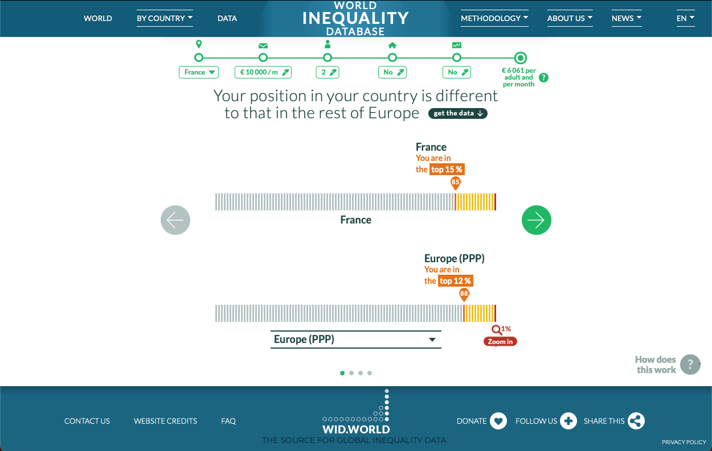
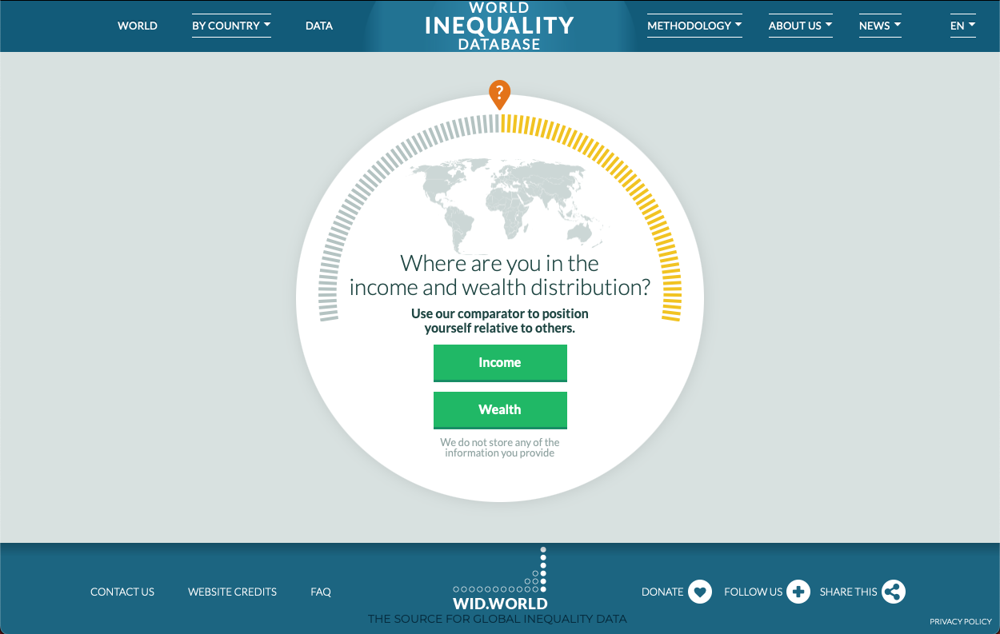

# wid-income-wealth-comparator
This is the official code repository for generating the input file for the backend of the wealth and income comparator. The comparator on [World Inequality Database (WID.world)](https://wid.world/) allows people to locate themselves in the wealth and income distribution of their country and of the world. It follows WID.world’s principle of providing a consistent view between wealth and income at the country-level (as measured by the international system of national accounts) and wealth and income at the individual level (as measured using household surveys and tax data).

## Acess
[WID - Income and welath comparator](https://wid.world/income-comparator/)
## Documentation
- [Methodology Overview](https://wid.world/how-does-our-income-comparator-work/)
- [Distributional National Accounts Guidelines](https://wid.world/document/distributional-national-accounts-guidelines-2020-concepts-and-methods-used-in-the-world-inequality-database/)
- [Research Tools](https://wid.world/research-tools/)
- [Codes Dictionary](https://wid.world/codes-dictionary/)
